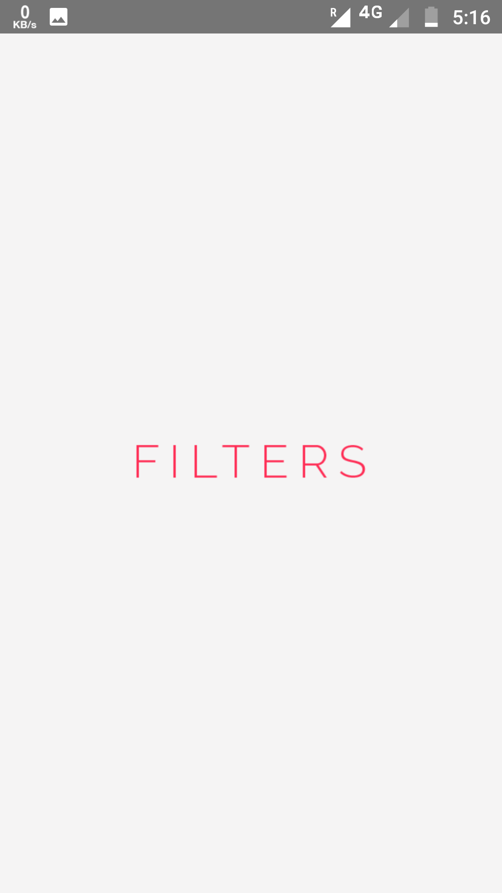
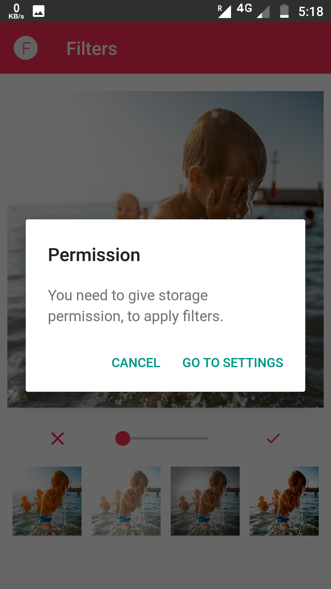
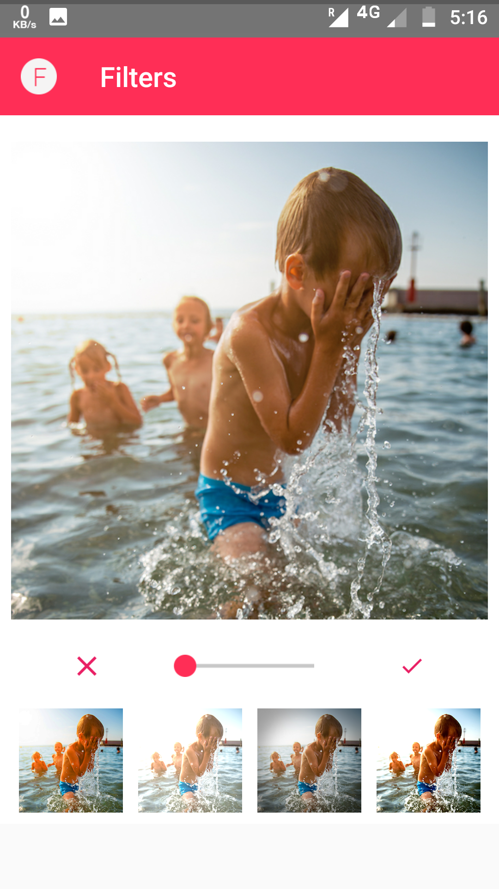
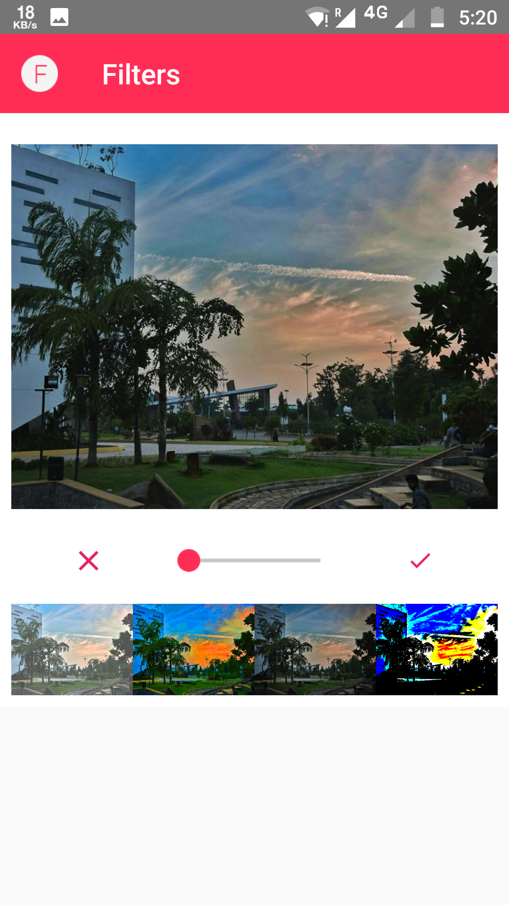

<h1> Image Filters App</h1>
<h3>This App lets you edit the image according to different filters present in the app.</h3>

 

 This is Splash Screen of the App 

  

It first time asks for the permission, which needs to be provided by you in order to proceed.

You need to give the permission to access the gallery. 

 

 This is the image selected from the gallery 

 This is the final applied filter 

